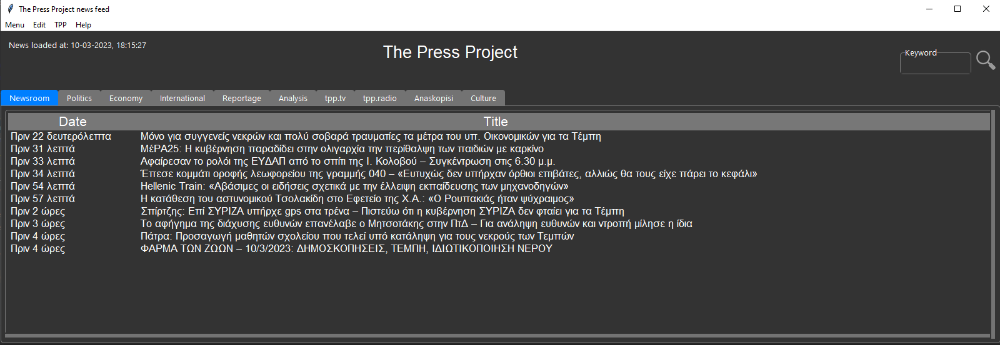

# ThePressProject Scraper GUI

## Description

This is my first project in order to learn Python. 
I have built so as to access the news faster and in a more aggregated manner than just reading the site.
It scrapes, using several 3rd party packages, the news categories of ThePressProject site.


## Table of Contents
- [Usage](#usage)
- [Convert to executable](#convert-to-executable)
- [Credits](#credits)
- [License](#license)

## Usage

The usage is pretty straightforward. 

The GUI automatically loads all the news titles and their date. The user can renew the titles through menu>renew titles.

There are 8 themes. 

The default theme is Azure dark. If the user clicks again the azure theme, it will switch to Azure light and vice versa. 

The GUI:


    ```
    
    ```

## Convert to executable

The script can be converted to an .exe by running in your terminal: 

	```
	py scrape_tpp_gui_pyinstaller.py 
	``` 

Note that the folders images & source, as well as, the .exe must be in the **same directory** in order the .exe to successfully run.

## Credits

Thanks to all the 3rd party packages maintainers and the StackOverflow users.
## Donate

Do not forget to donate monthly to [ThePressProject team](https://community.thepressproject.gr/?lang=en). Recurrent monthly donation/funding is the only way for a truly independable journalism to exist. 

## License
ThePressProject Trademark, name and all of its content belong to the ThePressProject team. 
The 3rd party packages have their own licenses.
All the code written by me is released under the MIT license.

---

🏆 The previous sections are the bare minimum, and your project will ultimately determine the content of this document. You might also want to consider adding the following sections.

## Badges


Badges aren't necessary, per se, but they demonstrate street cred. Badges let other developers know that you know what you're doing. Check out the badges hosted by [shields.io](https://shields.io/). You may not understand what they all represent now, but you will in time.

## Features

If your project has a lot of features, list them here.

## How to Contribute

If you created an application or package and would like other developers to contribute it, you can include guidelines for how to do so. The [Contributor Covenant](https://www.contributor-covenant.org/) is an industry standard, but you can always write your own if you'd prefer.

## Tests

Go the extra mile and write tests for your application. Then provide examples on how to run them here.
